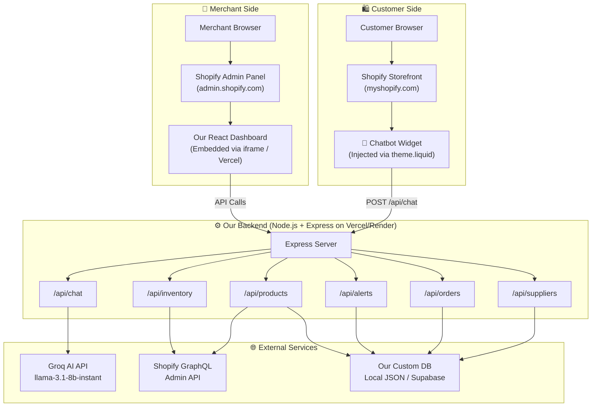
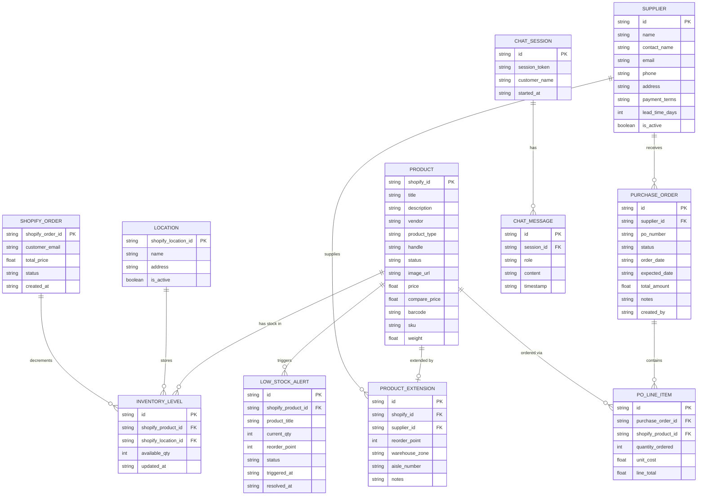
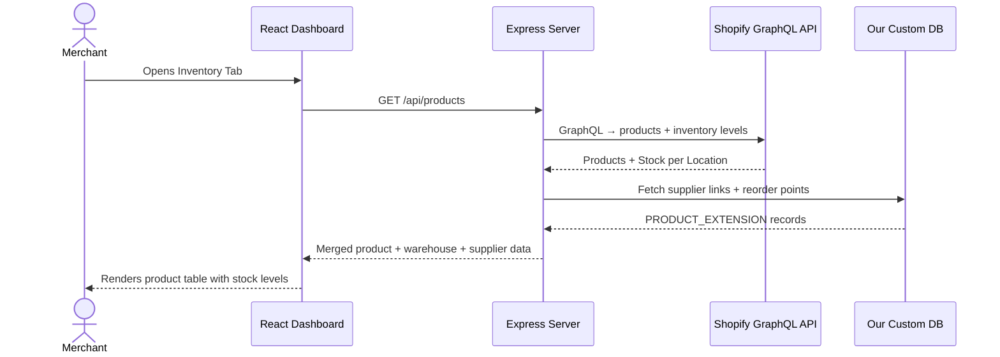
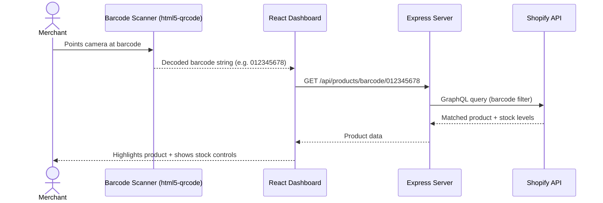
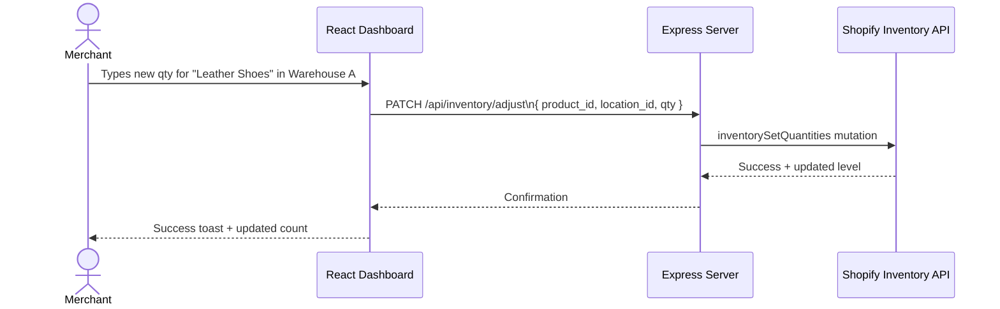
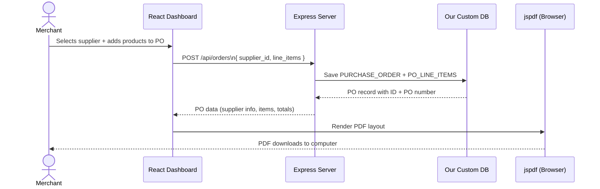
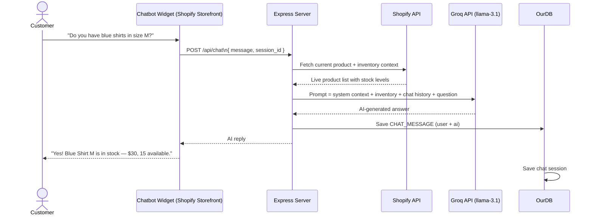
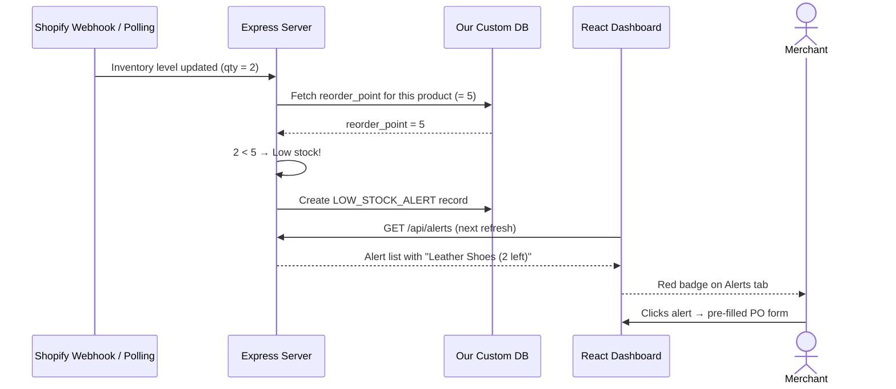
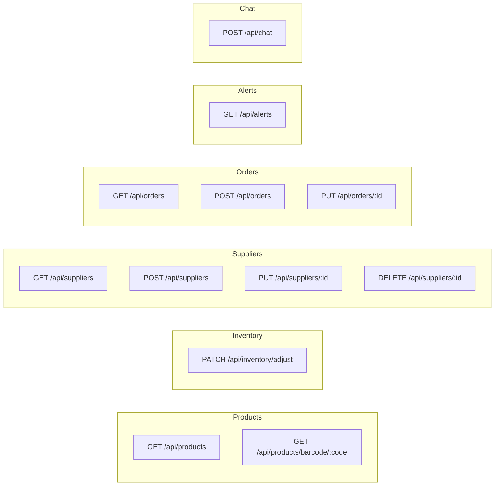

# System Architecture & ERD
## Shopify Inventory Management System + AI Customer Chatbot

---

## 1. Full System Architecture



---

## 2. Entity Relationship Diagram (ERD)



---

## 3. Data Flow Diagrams

### Flow A: Merchant Views Inventory Dashboard



### Flow B: Barcode Scan → Find Product



### Flow C: Merchant Adjusts Stock Level



### Flow D: Generate Purchase Order PDF



### Flow E: Customer Chats with AI Bot



### Flow F: Low-Stock Alert Triggered



---

## 4. API Route Map



---

## 5. Folder & File Structure

```mermaid
graph TD
    ROOT["My-First-Shopify/"]

    ROOT --> BE["backend/"]
    ROOT --> FE["frontend/"]

    BE --> SRV["server.js"]
    BE --> ENV[".env"]
    BE --> ENVE[".env.example"]
    BE --> ERD["erd.md"]
    BE --> BPKG["package.json"]
    BE --> SRC["src/"]

    SRC --> ROUTES["routes/"]
    ROUTES --> R1["products.js"]
    ROUTES --> R2["inventory.js"]
    ROUTES --> R3["suppliers.js"]
    ROUTES --> R4["orders.js"]
    ROUTES --> R5["alerts.js"]
    ROUTES --> R6["chat.js"]

    SRC --> SERVICES["services/"]
    SERVICES --> SV1["shopifyClient.js"]
    SERVICES --> SV2["groqClient.js"]
    SERVICES --> SV3["db.js"]

    SRC --> DATA["data/"]
    DATA --> D1["suppliers.json"]
    DATA --> D2["orders.json"]
    DATA --> D3["alerts.json"]
    DATA --> D4["extensions.json"]

    FE --> IH["index.html"]
    FE --> VC["vite.config.ts"]
    FE --> FSRC["src/"]

    FSRC --> APP["App.jsx"]
    FSRC --> CSS["index.css"]
    FSRC --> API["api/client.js"]
    FSRC --> COMP["components/"]

    COMP --> LAY["Layout/\nSidebar.jsx\nTopBar.jsx"]
    COMP --> OV["Overview/\nOverviewCards.jsx"]
    COMP --> INV["Inventory/\nProductTable.jsx\nProductForm.jsx\nBarcodeScanner.jsx"]
    COMP --> SUP["Suppliers/\nSupplierList.jsx\nSupplierForm.jsx"]
    COMP --> ORD["Orders/\nOrderList.jsx\nOrderForm.jsx\nPDFGenerator.js"]
    COMP --> ALT["Alerts/\nAlertPanel.jsx"]
    COMP --> CHAT["Chatbot/\nChatWidget.jsx"]
    COMP --> SET["Settings/\nSettings.jsx"]
```



---

## 6. Shopify GraphQL Queries

### Fetch All Products with Inventory
```graphql
query GetProductsWithInventory {
  products(first: 50) {
    edges {
      node {
        id
        title
        handle
        status
        vendor
        images(first: 1) { edges { node { url } } }
        variants(first: 1) {
          edges {
            node {
              id
              sku
              barcode
              price
              inventoryItem {
                id
                inventoryLevels(first: 5) {
                  edges {
                    node {
                      quantities(names: ["available"]) { quantity }
                      location { id name }
                    }
                  }
                }
              }
            }
          }
        }
      }
    }
  }
}
```

### Adjust Inventory Quantity
```graphql
mutation AdjustInventory($input: InventorySetQuantitiesInput!) {
  inventorySetQuantities(input: $input) {
    inventoryAdjustmentGroup {
      reason
      changes { name delta }
    }
    userErrors { field message }
  }
}
```

---

## 7. Groq RAG Prompt Template

```
You are a friendly store assistant for [Store Name].
Help customers find products, compare items, and check availability.

--- CURRENT INVENTORY (Real-Time) ---
{PRODUCT_CONTEXT}

Example:
- Blue Shirt (SKU: SHIRT-BLU): $30 | Sizes: S/M/L | Stock: 15
- Leather Shoes (SKU: SHOE-BRN): $80 | Sizes: 40-44 | Stock: 2 ⚠️ LOW
- White Sneakers (SKU: SNKR-WHT): $60 | Sizes: 38-45 | SOLD OUT

--- FAQs ---
- Shipping: Standard 3-5 days. Express 1-2 days.
- Returns: 30-day policy. Free returns on items over $50.
- Payment: Visa, Mastercard, GCash, PayMaya.

--- CONVERSATION HISTORY ---
{CHAT_HISTORY}

--- CUSTOMER QUESTION ---
{USER_MESSAGE}

Keep responses under 3 sentences. Suggest alternatives for sold-out items.
```
